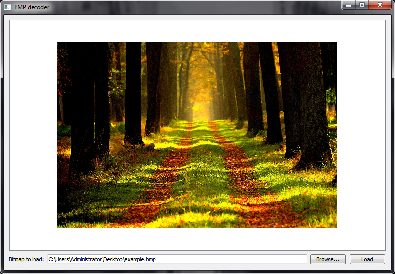

# BMPDecoder
Advanced Windows Bitmap decoder. Supports the following bit depths: 1 bpp, 4 bpp, 4 bpp RLE, 8 bpp, 8 bpp RLE, 16 bpp, 32 bpp. Written in Qt/C++.

## Download
Download link: [Win32 binary](https://github.com/Extender/BMPDecoder/raw/master/bin/bmpdecoder-v1.0-bin-win32.zip)

## Screenshot

